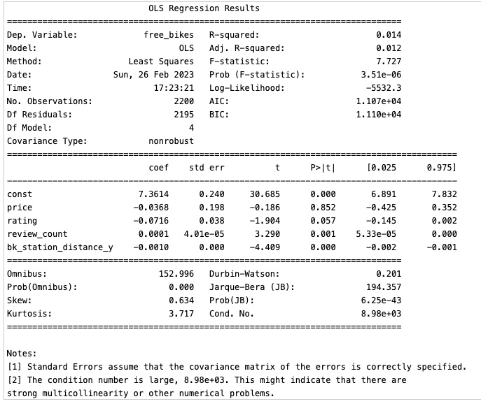

# Final Project Statistical Modelling with Python

## Project/Goals

Extract data using APIs with the aim of creating the dataset to construct a statistical model.
> The APIs used were:
> - Foursquare
> - Yelp
> - CityBikes

## Process

### **Step 1:** Data compilation and review City Bike API
- Review the JSON structure of the API response.
- I choose Los Angeles (LA) USA, because this city has a lot of stations.
- Review and normalize data from the .JSON file into a dataframe and export it into .csv after cleaning and processing.
More details can be found on [City Bikes Notebook](notebooks/city_bikes.ipynb).

### **Step 2:** Data recompilation and review of Foursquare and Yelp API
- Review the JSON structure of the API response.
- Use the file **.csv** generated by the City Bike API to filter locations nearby on these two APIs.
- Review and normalize data from the .JSON file into a dataframes and export it into **.csv** after cleaning and processing.
More details can be found on [Yelp & Foursquare Notebook](notebooks/yelp_foursquare_EDA.ipynb).

### **Step 3:** Creation of database and join data
- Import the three **.csv** into dataframes.
- Clean data and organize information after joining it.
- Check with EDA to process the data patterns.
- Import data into a **sqlite** database.
- Save the final data frame into .csv for the next task.
More details can be found on [Joining Data Notebook](notebooks/joining_data.ipynb).

### **Step 4:** Build a regression model and gather results
- Import data and review the behaviour of variables.
- Build model.
More details can be found on [Model Building Notebook](notebooks/model_building.ipynb).

## Results

- There is a small relationship between the bikes free and the reviews count, but after running the model, this relationship could not be proven.
- This model is missing more information or data on getting better results.

## Challenges 

- The main challenge was the different structures of information coming from Yelp and Foursquare. For example, in Foursquare's latest version, they removed the rating from the API reply.
- The API from Foursquare has categories and makes searching and getting specific data as replies easy. On the other hand, Yelp's API only searches by text and does not have a public categories code to search or filter.

## Future Goals

- Maybe using google reviews instead of foursquare could make it easier to match more information. 
- Also, having more information or better variables to construct a more statistically significant model.

